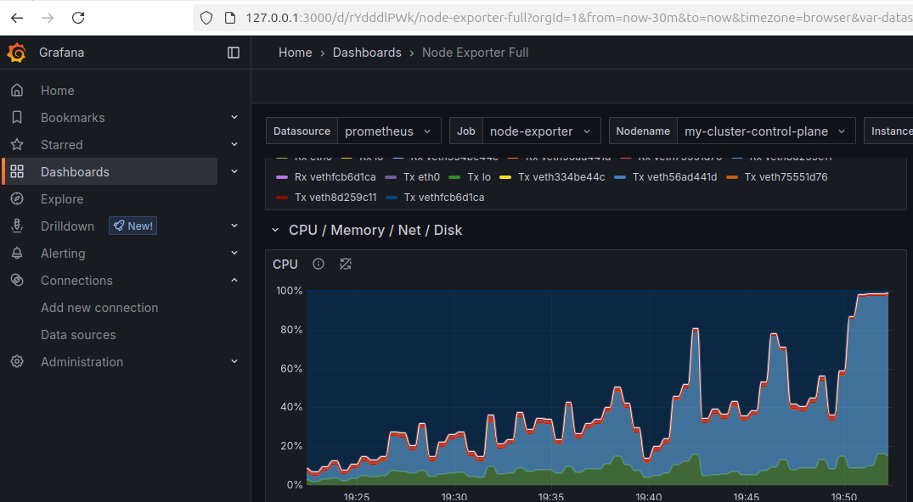
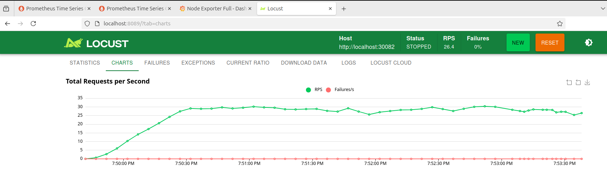

### 目標：

✅ 安裝 Docker、kubectl、kind go kubectl  docker-compose、Helm確認基本執行環境無誤   
✅ 使用 kind 成功架設一個 Kubernetes 叢集：1 個 control-plane 節點 3 個 worker 節點 其中 1 個 worker 節點標記為 infra node，其他 2 個為 application node    
✅ 安裝 MetalLB 並採用 Layer2 模式   
✅ 設定 MetalLB speaker 僅部署在 infra node   
✅ 建立 NGINX Deployment 並透過 LoadBalancer Service 暴露服務   
✅ 成功將 LoadBalancer 的 NodePort 指定對應到 host 已開放的 port   
✅ 驗證可透過 curl 與 瀏覽器 從 host 訪問 nginx 網頁 → 功能完全正常   
✅使用Locust進行壓力測試   
✅確認Pod有根據流量擴張   





### 壓力測試結果
```
kubectl top nodes
kubectl top pods
NAME                       CPU(cores)   CPU(%)   MEMORY(bytes)   MEMORY(%)   
my-cluster-control-plane   338m         8%       1179Mi          5%          
my-cluster-worker          85m          2%       275Mi           1%          
my-cluster-worker2         373m         9%       729Mi           3%          
my-cluster-worker3         301m         7%       465Mi           2%          
NAME                                  CPU(cores)   MEMORY(bytes)   
fastapi-deployment-8589b96f54-44n4d   3m           30Mi            
fastapi-deployment-8589b96f54-79vhp   16m          30Mi            
fastapi-deployment-8589b96f54-jf6m2   78m          30Mi            
fastapi-deployment-8589b96f54-ktd5r   100m         53Mi            
fastapi-deployment-8589b96f54-s9df8   33m          30Mi            
fastapi-deployment-8589b96f54-ss4j2   2m           30Mi            
fastapi-deployment-8589b96f54-v99mt   3m           30Mi            
fastapi-deployment-8589b96f54-vhsj9   100m         28Mi            
fastapi-deployment-8589b96f54-xjplj   69m          30Mi            
fastapi-deployment-8589b96f54-zhdjh   3m           30Mi            
nginx-7c79c4bf97-77plh                0m           4Mi             
u24@u24-VMware-Virtual-Platform:/opt/workspace/safe/yaml$ kubectl get pods 
NAME                                  READY   STATUS    RESTARTS   AGE
fastapi-deployment-8589b96f54-44n4d   1/1     Running   0          76s
fastapi-deployment-8589b96f54-79vhp   1/1     Running   0          46s
fastapi-deployment-8589b96f54-jf6m2   1/1     Running   0          31s
fastapi-deployment-8589b96f54-ktd5r   1/1     Running   0          25m
fastapi-deployment-8589b96f54-s9df8   1/1     Running   0          46s
fastapi-deployment-8589b96f54-ss4j2   1/1     Running   0          46s
fastapi-deployment-8589b96f54-v99mt   1/1     Running   0          76s
fastapi-deployment-8589b96f54-vhsj9   1/1     Running   0          31s
fastapi-deployment-8589b96f54-xjplj   1/1     Running   0          46s
fastapi-deployment-8589b96f54-zhdjh   1/1     Running   0          76s
nginx-7c79c4bf97-77plh                1/1     Running   0          4h57m
```

###  ✅ 使用 kind 成功架設一個 Kubernetes 叢集：
###### 1 個 control-plane 節點 3 個 worker 節點 其中 1 個 worker 節點標記為 infra node，其他 2 個為 application node 
```
kubectl get nodes 
NAME                       STATUS   ROLES           AGE     VERSION
my-cluster-control-plane   Ready    control-plane   6h28m   v1.29.2
my-cluster-worker          Ready    infra           6h27m   v1.29.2
my-cluster-worker2         Ready    application     6h27m   v1.29.2
my-cluster-worker3         Ready    application     6h27m   v1.29.2
```
### ✅ 設定 MetalLB speaker 僅部署在 infra node
```
kubectl get pods -n metallb-system
NAME                                 READY   STATUS    RESTARTS   AGE
metallb-controller-758987bc5-l6tlt   1/1     Running   0          6h28m
metallb-speaker-jsffp                4/4     Running   0          6h28m
```

```
🎯 Helm 安裝步驟 (Ubuntu)

curl https://baltocdn.com/helm/signing.asc | sudo apt-key add -
echo "deb https://baltocdn.com/helm/stable/debian/ all main" | sudo tee /etc/apt/sources.list.d/helm-stable-debian.list
sudo apt update
sudo apt install helm

### 安裝 go kubectl docker docker-compose、HELM

### 安裝kind
curl -Lo ./kind https://kind.sigs.k8s.io/dl/v0.22.0/kind-linux-amd64
chmod +x ./kind
sudo mv ./kind /usr/local/bin/kind
kind --version


1️⃣建立配置檔kind-config.yaml
# kind-config.yaml

kind: Cluster
apiVersion: kind.x-k8s.io/v1alpha4
nodes:
  - role: control-plane
  - role: worker
    extraPortMappings:
      - containerPort: 30080
        hostPort: 30080
      - containerPort: 30090
        hostPort: 30090
  - role: worker
    extraPortMappings:
      - containerPort: 30081
        hostPort: 30081
  - role: worker
    extraPortMappings:
      - containerPort: 30082
        hostPort: 30082


🔥 2️⃣ kind
kind create cluster --config kind-config.yaml --name my-cluster


🔥 3️⃣ 檢查節點
kubectl get nodes

🔥 4️⃣標記節點角色
kubectl label node my-cluster-worker node-role.kubernetes.io/infra=infra
kubectl label node my-cluster-worker2 node-role.kubernetes.io/application=application
kubectl label node my-cluster-worker3 node-role.kubernetes.io/application=application

🔥 5️⃣ 確認標記
kubectl get nodes --show-labels


🔥 4️⃣ 安裝 MetalLB (用 Helm)
helm repo add metallb https://metallb.github.io/metallb
helm repo update

kubectl create namespace metallb-system


5️⃣ 修改 values.yaml 指定 speaker 只在 infra node
metallb-values.yaml

speaker:
  nodeSelector:
    node-role.kubernetes.io/infra: infra

### 
helm install metallb metallb/metallb \
  --namespace metallb-system \
  --values metallb-values.yaml


✅ 6️⃣ 啟用 Layer2 模式（建立 AddressPool）
# metallb-config.yaml：

apiVersion: metallb.io/v1beta1
kind: IPAddressPool
metadata:
  name: my-ip-pool
  namespace: metallb-system
spec:
  addresses:
    - 172.21.255.1-172.21.255.250

---
apiVersion: metallb.io/v1beta1
kind: L2Advertisement
metadata:
  name: my-l2-advertisement
  namespace: metallb-system
spec:
  ipAddressPools:
    - my-ip-pool


1️⃣ 等 webhook pod Ready 再 apply config
kubectl wait --namespace metallb-system --for=condition=ready pod --selector=app.kubernetes.io/component=controller --timeout=120s
kubectl apply -f metallb-config.yaml

👉 檢查 MetalLB speaker 是否只跑在 infra node：

kubectl get pods -n metallb-system -o wide
NAME                                 READY   STATUS    RESTARTS   AGE     IP           NODE                 NOMINATED NODE   READINESS GATES
metallb-controller-758987bc5-ptwns   1/1     Running   0          8m41s   10.244.2.2   my-cluster-worker2   <none>           <none>
metallb-speaker-z7hx9                4/4     Running   0          8m41s   172.21.0.5   my-cluster-worker    <none>           <none>


🔍 測試 LoadBalancer
# metal-test-sv.yaml
apiVersion: v1
kind: Service
metadata:
  name: nginx-lb
spec:
  selector:
    app: nginx
  type: LoadBalancer
  ports:
    - port: 80
      targetPort: 80
      nodePort: 30080  # <-- 這邊指定 NodePort


kubectl apply -f metal-test-sv.yaml
kubectl get svc 

# metallb-test-nginx.yaml

apiVersion: apps/v1
kind: Deployment
metadata:
  name: nginx
spec:
  replicas: 1
  selector:
    matchLabels:
      app: nginx
  template:
    metadata:
      labels:
        app: nginx
    spec:
      containers:
      - name: nginx
        image: nginx:latest
        ports:
        - containerPort: 80


kubectl create -f metallb-test-nginx.yaml

curl http://127.0.0.1:30080

✅ STEP 1: 安裝 Prometheus + kube-state-metrics（限定 infra node）
1️⃣ 新增 Helm repo

helm repo add prometheus-community https://prometheus-community.github.io/helm-charts
helm repo update


2️⃣ 建立 prometheus-values.yaml： X 指定 nodeSelector 只在 infra node

prometheus:
  prometheusSpec:
    nodeSelector:
      node-role.kubernetes.io/control-plane: ""
    tolerations:
      - key: "node-role.kubernetes.io/control-plane"
        operator: "Exists"
        effect: "NoSchedule"

kube-state-metrics:
  nodeSelector:
    node-role.kubernetes.io/control-plane: ""
  tolerations:
    - key: "node-role.kubernetes.io/control-plane"
      operator: "Exists"
      effect: "NoSchedule"

nodeExporter:
  enabled: true


#  prometheus-service.yaml
# prometheus-service.yaml
apiVersion: v1
kind: Service
metadata:
  name: prometheus-server-ext
  namespace: monitoring
spec:
  type: LoadBalancer
  selector:
    app.kubernetes.io/name: prometheus
    app.kubernetes.io/instance: prometheus-kube-prometheus-prometheus
  ports:
    - port: 9090
      targetPort: 9090
      nodePort: 30090


kubectl delete svc prometheus-server-ext -n monitoring
kubectl apply -f prometheus-service.yaml
kubectl get endpoints prometheus-server-ext -n monitoring
kubectl get endpoints prometheus-server-ext -n monitoring
NAME                    ENDPOINTS   AGE
prometheus-server-ext   <none>      61s

3️⃣ 安裝 prometheus-stack
helm install prometheus prometheus-community/kube-prometheus-stack \
  --namespace monitoring --create-namespace \
  --values prometheus-values.yaml

kubectl get pods -n monitoring -o wide

### 用 network: host 模式啟動 Grafana
docker run -d --name grafana --network host grafana/grafana

✅ 設定 Prometheus DataSource：
http://172.21.255.2:9090
✅ 點「Save & Test」

6️⃣ 匯入 3 個監控儀表板（Dashboard）：
node exporter	        1860
kube-state-metrics	8588
kube-prometheus	        13332


# 5.6 每個 panel 內容說明
✅ node → node_exporter
✅ cluster → kube-state-metrics + core-metrics
✅ USE → node-exporter + kubelet
✅ etcd → etcd exporter
✅ Prometheus → internal metrics

# 安裝metrics-server
kubectl apply -f https://github.com/kubernetes-sigs/metrics-server/releases/latest/download/components.yaml
因為 kind 是用 自簽憑證，metrics-server 連接時會有 TLS 問題
→ 需要告訴 metrics-server 忽略 insecure TLS
```


### 目標：

✅ 安裝 Docker、kubectl、kind go kubectl  docker-compose、Helm確認基本執行環境無誤
✅ 使用 kind 成功架設一個 Kubernetes 叢集：
1 個 control-plane 節點 3 個 worker 節點 其中 1 個 worker 節點標記為 infra node，其他 2 個為 application node    
✅ 安裝 MetalLB 並採用 Layer2 模式
✅ 設定 MetalLB speaker 僅部署在 infra node
✅ 建立 NGINX Deployment 並透過 LoadBalancer Service 暴露服務
✅ 成功將 LoadBalancer 的 NodePort 指定對應到 host 已開放的 port
✅ 驗證可透過 curl 與 瀏覽器 從 host 訪問 nginx 網頁 → 功能完全正常
✅使用Locust進行壓力測試
✅確認Pod有根據流量擴張


### 壓力測試結果
```
kubectl top nodes
kubectl top pods
NAME                       CPU(cores)   CPU(%)   MEMORY(bytes)   MEMORY(%)   
my-cluster-control-plane   338m         8%       1179Mi          5%          
my-cluster-worker          85m          2%       275Mi           1%          
my-cluster-worker2         373m         9%       729Mi           3%          
my-cluster-worker3         301m         7%       465Mi           2%          
NAME                                  CPU(cores)   MEMORY(bytes)   
fastapi-deployment-8589b96f54-44n4d   3m           30Mi            
fastapi-deployment-8589b96f54-79vhp   16m          30Mi            
fastapi-deployment-8589b96f54-jf6m2   78m          30Mi            
fastapi-deployment-8589b96f54-ktd5r   100m         53Mi            
fastapi-deployment-8589b96f54-s9df8   33m          30Mi            
fastapi-deployment-8589b96f54-ss4j2   2m           30Mi            
fastapi-deployment-8589b96f54-v99mt   3m           30Mi            
fastapi-deployment-8589b96f54-vhsj9   100m         28Mi            
fastapi-deployment-8589b96f54-xjplj   69m          30Mi            
fastapi-deployment-8589b96f54-zhdjh   3m           30Mi            
nginx-7c79c4bf97-77plh                0m           4Mi             
u24@u24-VMware-Virtual-Platform:/opt/workspace/safe/yaml$ kubectl get pods 
NAME                                  READY   STATUS    RESTARTS   AGE
fastapi-deployment-8589b96f54-44n4d   1/1     Running   0          76s
fastapi-deployment-8589b96f54-79vhp   1/1     Running   0          46s
fastapi-deployment-8589b96f54-jf6m2   1/1     Running   0          31s
fastapi-deployment-8589b96f54-ktd5r   1/1     Running   0          25m
fastapi-deployment-8589b96f54-s9df8   1/1     Running   0          46s
fastapi-deployment-8589b96f54-ss4j2   1/1     Running   0          46s
fastapi-deployment-8589b96f54-v99mt   1/1     Running   0          76s
fastapi-deployment-8589b96f54-vhsj9   1/1     Running   0          31s
fastapi-deployment-8589b96f54-xjplj   1/1     Running   0          46s
fastapi-deployment-8589b96f54-zhdjh   1/1     Running   0          76s
nginx-7c79c4bf97-77plh                1/1     Running   0          4h57m
```

###  ✅ 使用 kind 成功架設一個 Kubernetes 叢集：
###### 1 個 control-plane 節點 3 個 worker 節點 其中 1 個 worker 節點標記為 infra node，其他 2 個為 application node 
```
kubectl get nodes 
NAME                       STATUS   ROLES           AGE     VERSION
my-cluster-control-plane   Ready    control-plane   6h28m   v1.29.2
my-cluster-worker          Ready    infra           6h27m   v1.29.2
my-cluster-worker2         Ready    application     6h27m   v1.29.2
my-cluster-worker3         Ready    application     6h27m   v1.29.2
```
### ✅ 設定 MetalLB speaker 僅部署在 infra node
```
kubectl get pods -n metallb-system
NAME                                 READY   STATUS    RESTARTS   AGE
metallb-controller-758987bc5-l6tlt   1/1     Running   0          6h28m
metallb-speaker-jsffp                4/4     Running   0          6h28m
```

```
🎯 Helm 安裝步驟 (Ubuntu)

curl https://baltocdn.com/helm/signing.asc | sudo apt-key add -
echo "deb https://baltocdn.com/helm/stable/debian/ all main" | sudo tee /etc/apt/sources.list.d/helm-stable-debian.list
sudo apt update
sudo apt install helm

### 安裝 go kubectl docker docker-compose、HELM

### 安裝kind
curl -Lo ./kind https://kind.sigs.k8s.io/dl/v0.22.0/kind-linux-amd64
chmod +x ./kind
sudo mv ./kind /usr/local/bin/kind
kind --version


1️⃣建立配置檔kind-config.yaml
# kind-config.yaml

kind: Cluster
apiVersion: kind.x-k8s.io/v1alpha4
nodes:
  - role: control-plane
  - role: worker
    extraPortMappings:
      - containerPort: 30080
        hostPort: 30080
      - containerPort: 30090
        hostPort: 30090
  - role: worker
    extraPortMappings:
      - containerPort: 30081
        hostPort: 30081
  - role: worker
    extraPortMappings:
      - containerPort: 30082
        hostPort: 30082


🔥 2️⃣ kind
kind create cluster --config kind-config.yaml --name my-cluster


🔥 3️⃣ 檢查節點
kubectl get nodes

🔥 4️⃣標記節點角色
kubectl label node my-cluster-worker node-role.kubernetes.io/infra=infra
kubectl label node my-cluster-worker2 node-role.kubernetes.io/application=application
kubectl label node my-cluster-worker3 node-role.kubernetes.io/application=application

🔥 5️⃣ 確認標記
kubectl get nodes --show-labels


🔥 4️⃣ 安裝 MetalLB (用 Helm)
helm repo add metallb https://metallb.github.io/metallb
helm repo update

kubectl create namespace metallb-system


5️⃣ 修改 values.yaml 指定 speaker 只在 infra node
metallb-values.yaml

speaker:
  nodeSelector:
    node-role.kubernetes.io/infra: infra

### 
helm install metallb metallb/metallb \
  --namespace metallb-system \
  --values metallb-values.yaml


✅ 6️⃣ 啟用 Layer2 模式（建立 AddressPool）
# metallb-config.yaml：

apiVersion: metallb.io/v1beta1
kind: IPAddressPool
metadata:
  name: my-ip-pool
  namespace: metallb-system
spec:
  addresses:
    - 172.21.255.1-172.21.255.250

---
apiVersion: metallb.io/v1beta1
kind: L2Advertisement
metadata:
  name: my-l2-advertisement
  namespace: metallb-system
spec:
  ipAddressPools:
    - my-ip-pool


1️⃣ 等 webhook pod Ready 再 apply config
kubectl wait --namespace metallb-system --for=condition=ready pod --selector=app.kubernetes.io/component=controller --timeout=120s
kubectl apply -f metallb-config.yaml

👉 檢查 MetalLB speaker 是否只跑在 infra node：

kubectl get pods -n metallb-system -o wide
NAME                                 READY   STATUS    RESTARTS   AGE     IP           NODE                 NOMINATED NODE   READINESS GATES
metallb-controller-758987bc5-ptwns   1/1     Running   0          8m41s   10.244.2.2   my-cluster-worker2   <none>           <none>
metallb-speaker-z7hx9                4/4     Running   0          8m41s   172.21.0.5   my-cluster-worker    <none>           <none>


🔍 測試 LoadBalancer
# metal-test-sv.yaml
apiVersion: v1
kind: Service
metadata:
  name: nginx-lb
spec:
  selector:
    app: nginx
  type: LoadBalancer
  ports:
    - port: 80
      targetPort: 80
      nodePort: 30080  # <-- 這邊指定 NodePort


kubectl apply -f metal-test-sv.yaml
kubectl get svc 

# metallb-test-nginx.yaml

apiVersion: apps/v1
kind: Deployment
metadata:
  name: nginx
spec:
  replicas: 1
  selector:
    matchLabels:
      app: nginx
  template:
    metadata:
      labels:
        app: nginx
    spec:
      containers:
      - name: nginx
        image: nginx:latest
        ports:
        - containerPort: 80


kubectl create -f metallb-test-nginx.yaml

curl http://127.0.0.1:30080

✅ STEP 1: 安裝 Prometheus + kube-state-metrics（限定 infra node）
1️⃣ 新增 Helm repo

helm repo add prometheus-community https://prometheus-community.github.io/helm-charts
helm repo update


2️⃣ 建立 prometheus-values.yaml： X 指定 nodeSelector 只在 infra node

prometheus:
  prometheusSpec:
    nodeSelector:
      node-role.kubernetes.io/control-plane: ""
    tolerations:
      - key: "node-role.kubernetes.io/control-plane"
        operator: "Exists"
        effect: "NoSchedule"

kube-state-metrics:
  nodeSelector:
    node-role.kubernetes.io/control-plane: ""
  tolerations:
    - key: "node-role.kubernetes.io/control-plane"
      operator: "Exists"
      effect: "NoSchedule"

nodeExporter:
  enabled: true


#  prometheus-service.yaml
# prometheus-service.yaml
apiVersion: v1
kind: Service
metadata:
  name: prometheus-server-ext
  namespace: monitoring
spec:
  type: LoadBalancer
  selector:
    app.kubernetes.io/name: prometheus
    app.kubernetes.io/instance: prometheus-kube-prometheus-prometheus
  ports:
    - port: 9090
      targetPort: 9090
      nodePort: 30090


kubectl delete svc prometheus-server-ext -n monitoring
kubectl apply -f prometheus-service.yaml
kubectl get endpoints prometheus-server-ext -n monitoring
kubectl get endpoints prometheus-server-ext -n monitoring
NAME                    ENDPOINTS   AGE
prometheus-server-ext   <none>      61s

3️⃣ 安裝 prometheus-stack
helm install prometheus prometheus-community/kube-prometheus-stack \
  --namespace monitoring --create-namespace \
  --values prometheus-values.yaml

kubectl get pods -n monitoring -o wide

### 用 network: host 模式啟動 Grafana
docker run -d --name grafana --network host grafana/grafana

✅ 設定 Prometheus DataSource：
http://172.21.255.2:9090
✅ 點「Save & Test」

6️⃣ 匯入 3 個監控儀表板（Dashboard）：
node exporter	        1860
kube-state-metrics	8588
kube-prometheus	        13332


# 5.6 每個 panel 內容說明
✅ node → node_exporter
✅ cluster → kube-state-metrics + core-metrics
✅ USE → node-exporter + kubelet
✅ etcd → etcd exporter
✅ Prometheus → internal metrics

# 安裝metrics-server
kubectl apply -f https://github.com/kubernetes-sigs/metrics-server/releases/latest/download/components.yaml
因為 kind 是用 自簽憑證，metrics-server 連接時會有 TLS 問題
→ 需要告訴 metrics-server 忽略 insecure TLS
```


